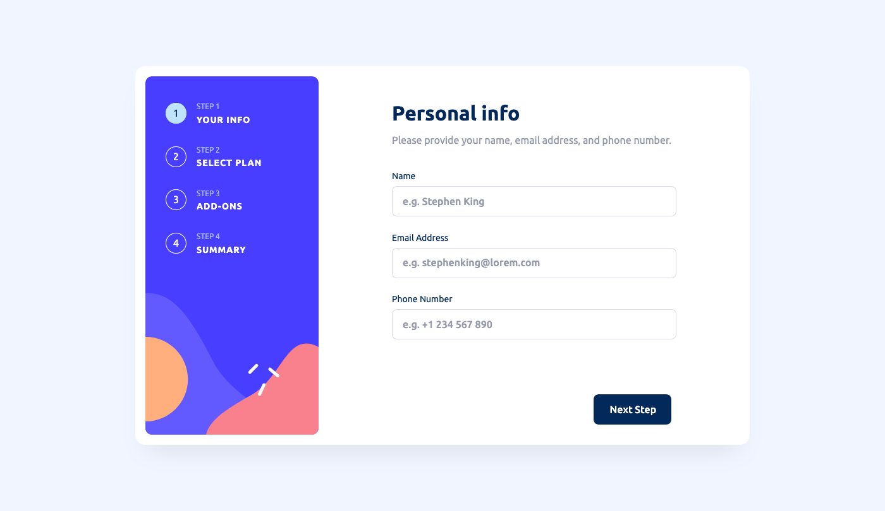

# Frontend Mentor - Multi-step form solution

This is a solution to the [Multi-step form challenge on Frontend Mentor](https://www.frontendmentor.io/challenges/multistep-form-YVAnSdqQBJ). Frontend Mentor challenges help you improve your coding skills by building realistic projects.

## About the Project

The **"Multi Step Form"** challenge from Frontend Mentor was an exercise in creating a user-friendly, multi-step form experience.

This project was built using Vite for development efficiency, React for its component architecture, framer-motion for smooth entry animations, TypeScript for type safety, and Scss for styling.

The form data is managed through React's Context API, ensuring state is easily accessible across components, and stored in local storage for persistence across page refreshes.

Note that some coding decisions might reflect an amateur approach, as this was developed during my learning phase with these technologies.

## Preview and Links

| [Live Demo URL](https://ionstici.github.io/multi-step-form) | [Frontend Mentor](https://www.frontendmentor.io/solutions/multi-step-form-KrYCZo-F9I) |
| ----------------------------------------------------------- | ------------------------------------------------------------------------------------- |

## Features

- **Multi-Step Process:** Users navigate through several steps to complete the form.
- **Data Persistence:** Utilizes local storage to save form data, ensuring it persists after page reloads.
- **State Management:** Leverages React Context API for efficient state management across form steps.
- **Animations:** Implements framer-motion for smooth entry animations on each step.
- **Responsive Design:** Constructed with Scss to ensure adaptability across different devices.
- **Type Safety:** TypeScript is used to enhance code quality and prevent type-related errors.

## Built with

- **`Vite`:** For a streamlined development experience.
- **`React`:** To handle the component-based structure and state management.
- **`framer-motion`:** For adding smooth entry animations to enhance user interaction.
- **`TypeScript`:** To improve development with static typing.
- **`Scss`:** For modular and maintainable CSS styling.

## Deployment

This project is hosted on **GitHub Pages**.

## Contact

- [ionStici | GitHub](https://github.com/ionStici)
- [Ion Stici | LinkedIn](https://www.linkedin.com/in/ionstici/)

Feel free to reach out if you have any questions or suggestions!
